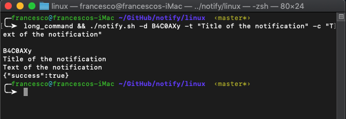

# Notify
This app app allows you to send notifications from your Linux/Mac computer via terminal and receive them on your android phone. The android application gives you a Token that you have to pass to the script in the linux folder.
To send a notification with Text, Title and to a user with Token you have to execute the following command

```
./notify.sh -d Token -t Title -c Text
```
<p align="center">

 

## Example of notification

<p align="center">
  


[apk download](https://arcane-tor-21270.herokuapp.com/)

